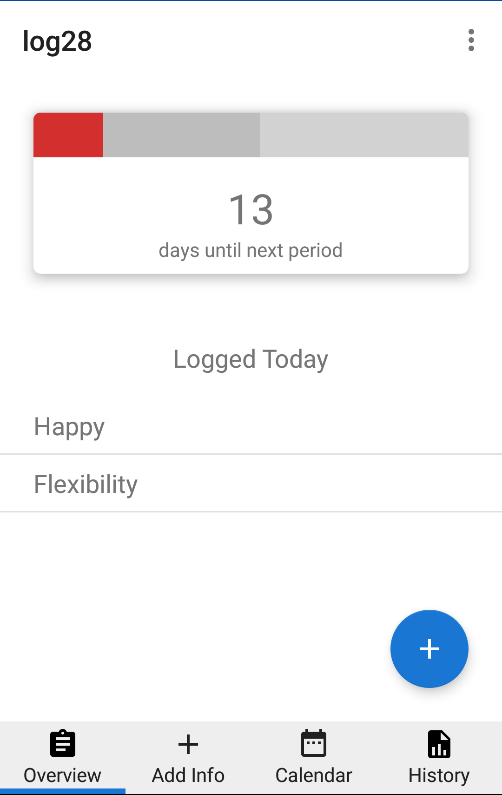

# log28 - a simple no-frills period tracker for Android

## Database Information

log28 uses [realm](https://realm.io) as it's database. There are 3 "tables"

Category - these are the categories of symptoms. They have a name and boolean for whether they are active.
Symptom - symptoms belong to categories and have names.
DayData - represents the data for a single day. These objects have a list of symptoms that have been recorded that day.

Models and import/export code are located in Database.kt, Queries are located in Queries.kt

## Views

There are four main views (tabs) in log28, as well as the App into screens and settings

* Cycle Overview - overview showing when the next period will be
* Day View - allows a user to view and edit data for any day
* Calendar View - shows period info on a calendar
* Cycle History - Shows the previous cycle start date and lengths in a list
* Settings - settings for the app, note that there is a separate activity for enabling and disabling individual tracking options. There is also a custom adapter used to store the cycle information in the Realm database instead of the default preference storage.
